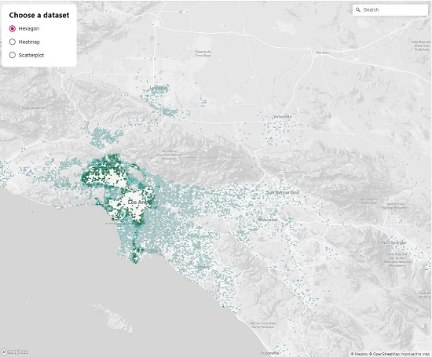

# Orbital Penguins Data Map Visualization Tool

### Reference

- [Miro Board](https://miro.com/app/board/o9J_lMPHeoo=/)
- [Project Plan Google Docs](https://docs.google.com/document/d/1cfqFDoHBj0jy1ysmjlV7y5nwpOfwz7TCiEJbX7gNZTc/edit)
- [Initial Präsentation](./Home_Planet_at_Your_Fingertips.pdf)

### Technologies

- React App
- [Deck.gl](https://deck.gl/docs/get-started/using-with-react)
- [Mapbox](https://www.mapbox.com/)

### Frontend (App)

- `yarn install`
- insert MAPBOX_ACCESS_TOKEN in src/App.js
- `yarn start`
- localhost:3000

### Backend

- `npm run start`
- localhost:9000

### Data Source

- CO2 Data: ftp://asc-csa.gc.ca/users/OpenData_DonneesOuvertes ?

### Deployment

- Frontend: https://vm-fuchsia.multimediatechnology.at/
- Backend: https://orbital-penguins-backend.herokuapp.com/

### Demo

### Members

- Tamara Moß
- Daniela Wollmarker
- Lena Ebner
- Fabian Bliem
- Benjamin Halilovic
- Elias Bader
