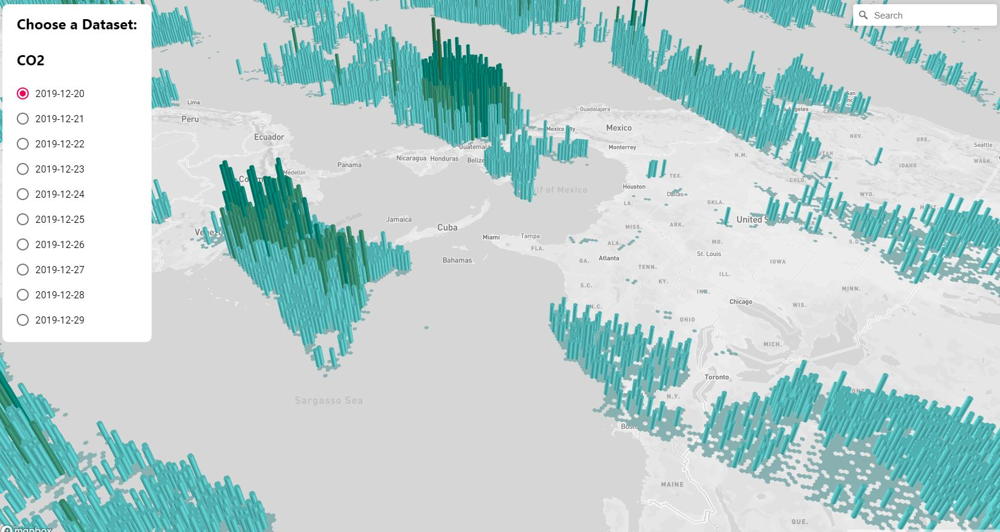

# Orbital Penguins Data Map Visualization Tool
### Reference
    https://fireship.io/lessons/deckgl-google-maps-tutorial/

### Technologies
- React App
- [Deck.gl](https://deck.gl/docs/get-started/using-with-react)
- [Mapbox](https://www.mapbox.com/)

### Usage
- `yarn install`
- insert MAPBOX_ACCESS_TOKEN in src/App.js
- `yarn start`

### Demo

### Members
- Tamara Moß
- Daniela Wollmarker
- Lena Ebner
- Fabian Bliem
- Benjamin Halilovic
- Elias Bader
